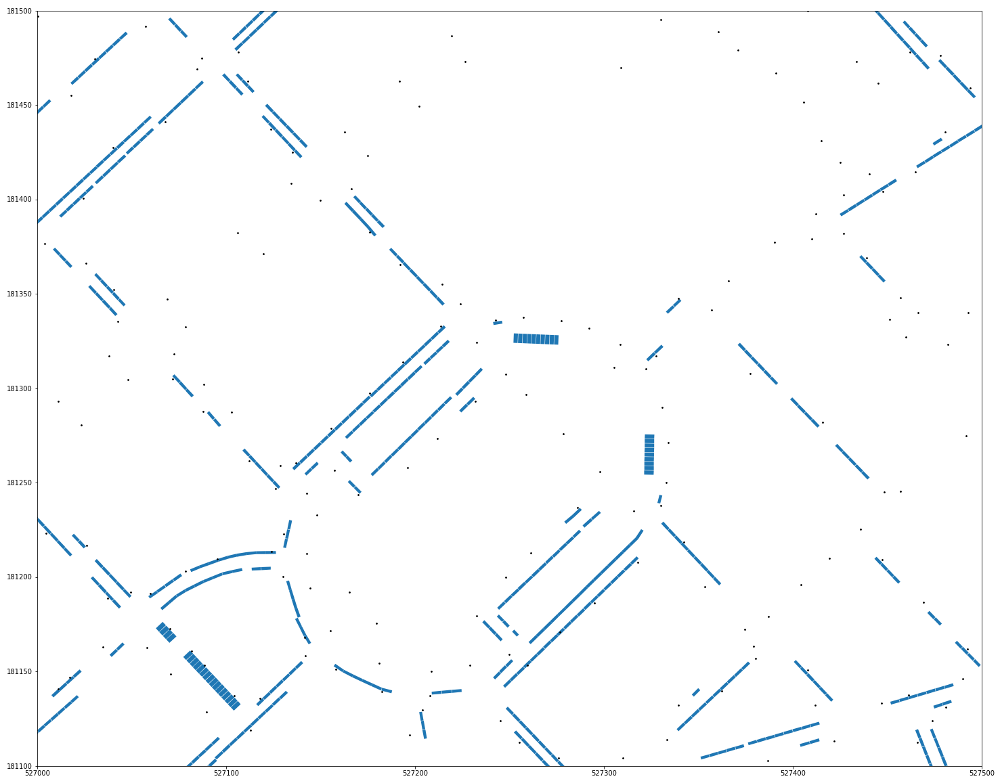
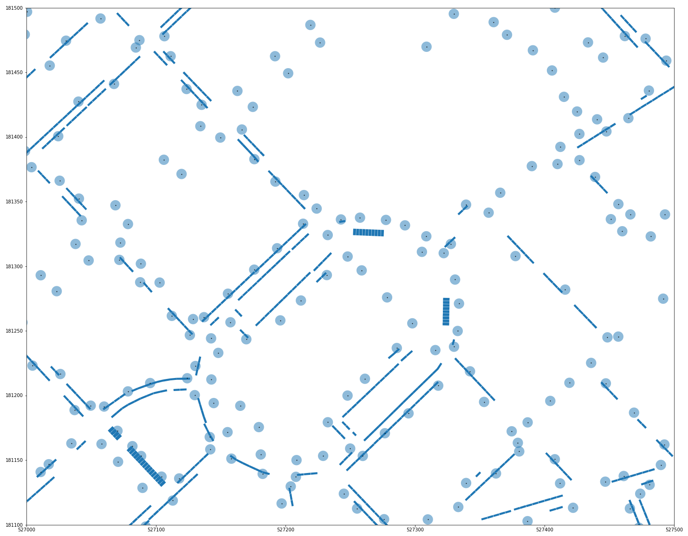
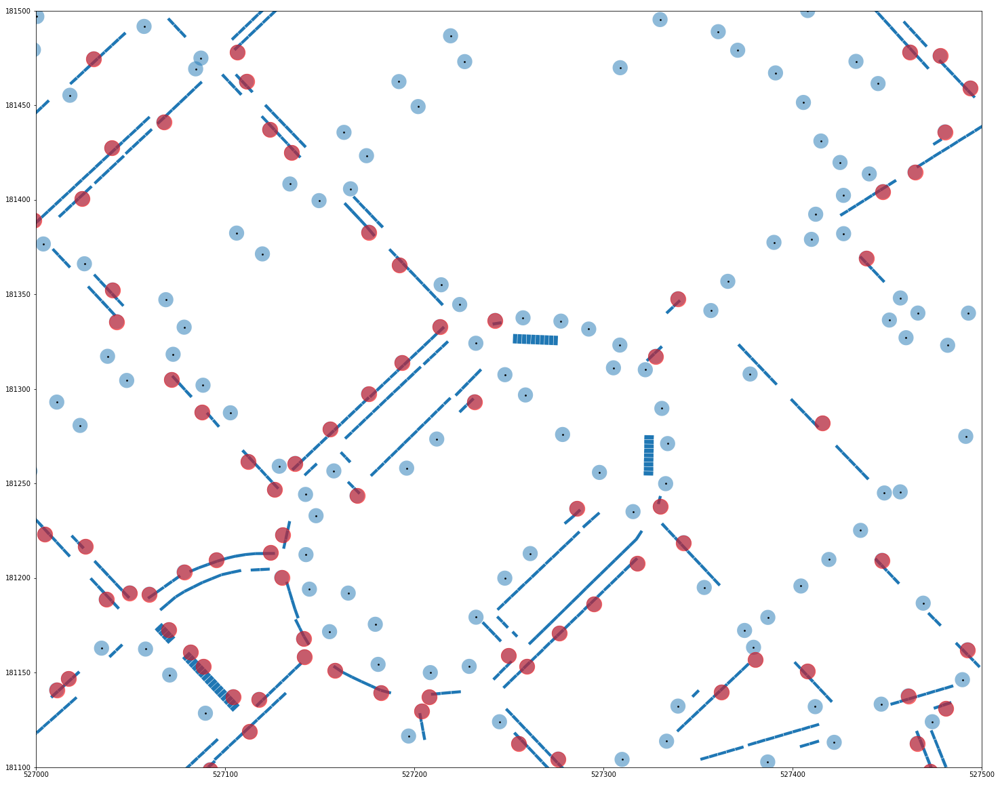

---
# CUSTOM CSS
--- 
<style>                     
.navbar {
  background-color:#2c3e50;
  border-color: black;
}

div .chart-stage .chart-stage-flex {
  padding-left: 0px;
}

.navbar-inverse .navbar-nav>.active>a {
  background-color: #1a242f;
}

.navbar-inverse .navbar-nav>li>a:hover {
  background-color: #1a242f;
}

.navbar-inverse .navbar-nav>.active>a, .navbar-inverse .navbar-nav>.active>a:hover, .navbar-inverse .navbar-nav>.active>a:focus {
  background-color: #1a242f;
}

.nav-tabs-custom > .nav-tabs > li.active {
  border-top-color: #1a242f;
}

.awesome-marker {
  transform: scale(0.5,0.5)
}

.storyboard-nav .sbframelist ul li.active {
    background: #2c3e50;
}

.leaflet-control-layers-expanded {
  color: white;
  background: black;
}

.leaflet .legend i{
  border-radius: 50%;
  width: 10px;
  height: 10px;
  margin-top: 4px;
}

.leaflet-control-attribution {
  display: none;
}

#full_map {
    background: #000;
}  

.legend {
  color: white;
  background: black;
}

.leaflet-popup-content-wrapper, .leaflet-popup-tip {
  background: black;
  color: white;
}
</style> 

```{r setup, include=FALSE}
library(flexdashboard)
library(dplyr)
library(leaflet)
library(plotly)
library(stringr)
library(leaflet.extras)
library(rgdal)
library(knitr)
```

```{r, results='hide'}
source("~/Documents/WestminsterPosition/organised/full_overlay_map/github_pages_ev_map/concat_data.R")

columns <- read.csv("../../data/clean_data_files/lamp_columns/lamp_column_assets.csv", stringsAsFactors = FALSE)
dedicated_locations <- read.csv("../../data/raw_data_files/charger_locations/EV_Charge_Points_List_WebMap.csv")

columns <- columns %>%
  dplyr::mutate(colour = ifelse(suitable == "True", "#D4AC0D", "#6C3483"))

res_bay <- rgdal::readOGR("../../data/clean_data_files/parking_bays/res_bays.json")


columns$labs <- sapply(seq(nrow(columns)), function(i) {
    paste0( '<p><strong>ID: </strong>', 
            columns[i, "central_asset_id"],'</p><p><strong>Listed: </strong>', 
            columns[i, "listed"],'</p><p><strong>Column Type: </strong>',
            columns[i, "coltype"],'</p>') 
})

lccp <- full_points %>% dplyr::filter(Provider=="Ubitricity")
```

Map {data-icon="glyphicon-flash"}
=====================================  

### Full Map {.no-padding .no-title}

```{r}
addLegendCustom <- function(map, colors, labels, sizes, opacity = 1){
  colorAdditions <- paste0(colors, "; width:", sizes, "px; height:", sizes, "px")
  labelAdditions <- paste0("<div style='display: inline-block;height: ", sizes, "px;margin-top: 4px;line-height: ", sizes, "px;'>", labels, "</div>")

  return(addLegend(map, colors = colorAdditions, labels = labelAdditions, opacity = opacity))
}

columns %>%
  leaflet(options= leafletOptions(preferCanvas = TRUE), elementId = "full_map") %>%
  addProviderTiles(providers$CartoDB.DarkMatter) %>% 
  fitBounds(-0.18, 51.495, -0.13, 51.528) %>%
  addPolygons(data=res_bay, stroke = FALSE, fillColor = "#8B0000", fillOpacity = 1, group="Residential Parking Bays") %>%
  addCircles(lat = ~lat, lng = ~lon, radius = 3, stroke = FALSE, fillColor = ~colour, fillOpacity = 1, popup=~labs, group="Lamp Columns") %>%
  addCircles(data = lccp, radius = 10, stroke = FALSE, fillColor = "white", fillOpacity = 1, group="Lamp Column Chargers", popup=~labs)  %>%
  addCircles(data=dedicated_locations, lat=~Latitude, lng=~Longtitude, radius = 15, stroke=FALSE, fillColor = "#fffdd0", fillOpacity = 1, group="Dedicated Fast Chargers", popup=~Charge_Point) %>%
  addLegendCustom(colors = c("#6C3483", "#D4AC0D", "white", "#fffdd0"), labels = c("Non Convertible LC", "Potentially Convertible LC", "Existing LCCP", "Dedicated Fast Chargers"), sizes = c(15, 15, 20, 25)) %>%
  addLegend(position="bottomright", labels = c("Suitable LC Locations: 2,621", "Unsuitable LC Locations: 9,667", "Existing LC Charge Points: 819"), values="d", colors = c("black","black","black")) %>%
  addLayersControl(
    overlayGroups = c("Residential Parking Bays", "Dedicated Fast Chargers", "Lamp Columns", "Lamp Column Chargers"),
    position="bottomleft",
    options = layersControlOptions(collapsed = FALSE, autoZIndex = TRUE)
  ) %>%
  hideGroup(c("Residential Parking Bays", "Dedicated Fast Chargers")) %>%
  addSearchOSM() 
```


About {data-icon="fa-bars"}
===================================== 

#### Potential Lamp Column Charger Locations

* Author: Jack Humble
* Date Created: 06/05/2020
* Date Updated: 11/05/2021
* Email: jhumble@westminster.gov.uk
* Data: LCCP and Lamp Column data can be found [here](https://github.com/Jhumbl/lccp_suitability/tree/main/data).

The map provided in conjunction with this report shows the result of a suitability analysis of all Westminster lamp columns and their ability to be converted into charging columns for electric vehicles.

The variables determining this ability include lamp column type, lamp column listing and type of parking bays nearby. There are fifty different types of lamp columns in Westminster. However, only two can be converted into an electric vehicle charge point. These two types of column are:

* Standard
* Large Grey Wornum

Of the lamp columns of these types, they can be listed as Heritage, Cherished, Functional, Listed or Not Specified. Lamp columns which are listed as the following two cannot be converted into a lamp column:

* Cherished
* Listed

In addition to this, lamp columns would be prefereable if they are adjacet to residential parking bays. We can calculate this by creating a buffer of 4m around each lamp column and only selecting the columns that intersect with residential parking bays. The following three images visualise this process.

```{r, out.width="30%", out.height="30%", fig.cap="Figure 1: Lamp Columns (Points) and Residential Parking Bays (Rectangles)"}

```

```{r, out.width="30%", out.height="30%", fig.cap="Figure 2: A buffer of 4 meters is added to each lamp column"}

```

```{r, out.width="30%", out.height="30%", fig.cap="Figure 3: If the buffer overlaps a residential bay, it is likely adjacent (red circles)."}

```

#### Limitations

The are a number of limitations to the type of analysis. They are as follows:

* Data quality: Some of the lamp columns or parking bays may not have a completly accurate latitude and longitude coordinate. Columns may also have the incorrect type and listing label.
* The buffer of four meters was empirically chosen. It may be the case that this is too large, thereby including columns that are, in fact, not suitable. On the contrary, it may be too small, thereby discounting potentially suitable columns.

